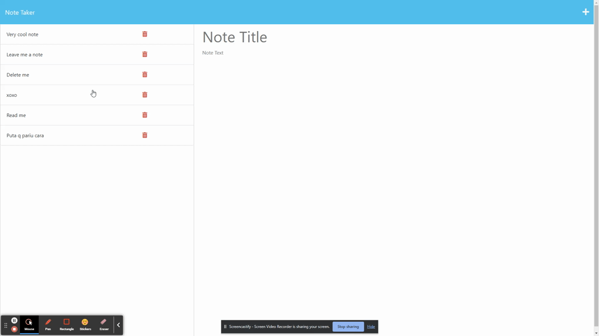

# Note Taker



## Description
This application is the week 11 project of the edX/Monash bootcamp with a focus on express.js.  The task was to build a note taking app that utilises GET, POST and DELETE HTTP methods.  I used modular routing and made a folder system to keep things a little more organised instead of putting all routes in the same folder.  I also used in-built middleware and hope to add my own custom middleware to console log different HTTP events.  I got good experience using Insomnia, through testing all my API calls, and using it to troubleshoot at some points.  I had some fun making a 9-digit ID creator function, which I was happy that I could use the array filter method because I'd just spent an hour using it and pulling my hair out over AlgoExpert challenges.  Although I used arrays for this function, I probably didn't need to... but arrays are king.

The acceptance criteria of this project were as follows:

```md
GIVEN a note-taking application
WHEN I open the Note Taker
THEN I am presented with a landing page with a link to a notes page
WHEN I click on the link to the notes page
THEN I am presented with a page with existing notes listed in the left-hand column, plus empty fields to enter a new note title and the note’s text in the right-hand column
WHEN I enter a new note title and the note’s text
THEN a Save icon appears in the navigation at the top of the page
WHEN I click on the Save icon
THEN the new note I have entered is saved and appears in the left-hand column with the other existing notes
WHEN I click on an existing note in the list in the left-hand column
THEN that note appears in the right-hand column
WHEN I click on the Write icon in the navigation at the top of the page
THEN I am presented with empty fields to enter a new note title and the note’s text in the right-hand column
```

## Table of Contents

1. [Installation](#installation)
2. [Deployed Application](#deployed-application)
3. [Usage](#usage)
4. [License](#license)
5. [Contribution](#contribution)
6. [Questions](#questions)

## Installation
Simply go to the deployed application link provided below.

## Deployed Application
Deployed via Heroku at <https://infinite-wave-89582-130278b6b9b3.herokuapp.com/><br>
GitHub Repository: <https://github.com/x4ndez/notetaker>

## Usage
Click "Get Started" to begin taking notes that anyone with this link can access! Click the + icon in the top right hand corner and store all the credentials for all your apps! You can save a note by clicking the save icon that will appear after you begin typing a note body.  Once your credentials are saved, they are stored forever in the land of the internet, so you better change all your passwords now!  ...Ha!  There's a delete button, but we can't promise your credentials haven't been stolen by some sneaky online cyber-scraping gypsy wizards.  We hope you've had a good experience with "Note Taker" - The most exciting note taker from 0.0.0.0 to 255.255.255.255!

## License
<br>
This project is covered under the MIT License.

## Contribution
x4ndez: <https://github.com/x4ndez>
Starter code obtained from: <https://github.com/coding-boot-camp/miniature-eureka>

## Questions
Questions may be directed to my LinkedIn: <https://www.linkedin.com/in/alexandernanfro/>.